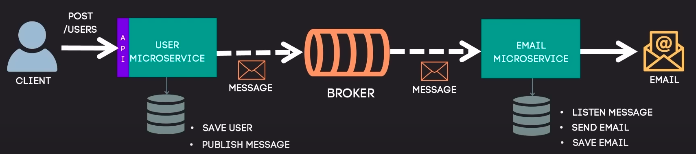

# microservices-java-example

## Flow

* An client sends a POST to register a new user
  * User microservice will do it.
* User microservice (Producer) saves the new user in a database.
* User microservice publish the message in a broker (RabbitMQ - CloudAMQP).
* Email microservice (Consumer) listen and consume the messages in the broker in async mode.
* Email microservice send an email to the final destination and saves email's register in a database.
